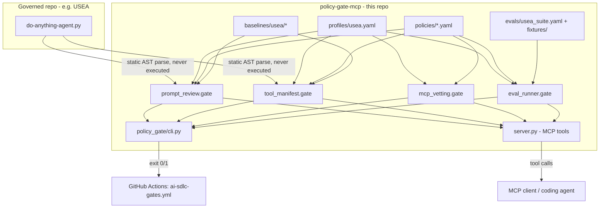

# policy-gate-mcp

Policy-as-code **AI-SDLC gates** for LLM agent repos, shipped as both an
**MCP server** (for interactive use from an editor/agent) and a **CLI**
(for CI). It is pre-configured to govern the
[USEA](https://github.com/iestarks/USEA) agent, and is written so any
other agent repo can be onboarded as a new "profile".

It implements the four gates requested for the AI-SDLC:

| Gate | What it checks | Module |
|---|---|---|
| 1. Prompt / system-prompt review | The assembled system prompt against forbidden/required patterns, a length limit, and a reviewed baseline | [`policy_gate/prompt_review.py`](policy_gate/prompt_review.py) |
| 2. Tool manifest diffing | Every tool exposed to the agent, diffed against a recorded baseline, risk-classified, with sign-off required for high/critical changes | [`policy_gate/tool_manifest.py`](policy_gate/tool_manifest.py) |
| 3. MCP server vetting | Any `mcpServers` config (command allowlist, pinned versions, remote domain allowlist, no plaintext secrets, required trust review) | [`policy_gate/mcp_vetting.py`](policy_gate/mcp_vetting.py) |
| 4. Eval suites as CI regression tests | Golden-transcript eval cases with `blocking` (zero-tolerance) vs. `warning` (pass-rate threshold) severities | [`policy_gate/eval_runner.py`](policy_gate/eval_runner.py) |

Every gate returns the same `GateResult` shape (`pass` / `warn` / `fail`
/ `skipped`, a list of violations, and structured details), so the MCP
tool, the CLI subcommand, and the CI job all agree on the verdict.

## Why this exists

Agent repos like USEA change three things that traditional CI never
looked at: the **system prompt**, the **tool manifest** (what the model
is allowed to *do*), and the **MCP servers** it can talk to. A one-line
prompt edit or a new tool can silently turn a "read files" agent into a
"run arbitrary shell commands and exfiltrate secrets" agent, and normal
unit tests won't catch it. This repo turns those three surfaces - plus
behavioral regressions - into things that are diffed, classified, and
gated in the same PR review flow as code.

## Architecture



Key design choices:

- **Static analysis, not execution.** Both the prompt-review and
  tool-manifest gates parse the target file with `ast` and never
  `import`/`exec` it. There's no need for the governed repo's runtime
  dependencies (LangChain, provider SDKs, etc.) to run these two gates,
  and a malicious prompt/tool can't execute code during the gate itself.
- **Profiles, not hardcoding.** `profiles/usea.yaml` is the only place
  that knows USEA's file names and variable names. Onboarding a second
  agent means adding `profiles/<name>.yaml` plus its own
  `baselines/<name>/...` and `evals/<name>_suite.yaml` - the gate engine
  itself is generic.
- **Policies are reviewable YAML, not code.** All four gates read their
  rules from `policies/*.yaml`. Changing what's blocked is a normal,
  diffable pull request against this repo, not a code change.
- **Fail closed.** An unrecognized tool, a missing baseline file's
  sign-off, or an unclassified MCP server all fail the gate rather than
  silently passing.

## The four gates in detail

### Gate 1 - Prompt / system-prompt review

`prompt_review.py` walks the target file's AST and reconstructs every
string assigned or `+=`-appended to a configured variable (`system_content`
for USEA), ordered by source line number so conditional branches (e.g. the
Vault-policy block that's only appended `if vault_enabled`) come out in
the same order a human reading the file would see them.

The reconstructed text is checked against
[`policies/prompt_policy.yaml`](policies/prompt_policy.yaml):

- **`forbidden_patterns`** - regexes that must never appear (prompt-injection
  phrasing like "ignore previous instructions", jailbreak personas, "disable
  safety", "output the raw API key", etc.), each with a human-readable reason.
- **`required_patterns`** - regexes that must appear (USEA's policy requires
  the prompt to instruct the model to mask sensitive values and to explain
  risk before acting).
- **`max_length_chars`** - a hard cap.
- **Baseline diff** - if the extracted prompt no longer matches
  [`baselines/usea/system_prompt.baseline.txt`](baselines/usea/system_prompt.baseline.txt),
  the gate fails *unless* `policies/prompt_review_log.yaml` has a matching
  entry (reviewer, date, PR link). This is what turns "someone tweaked the
  system prompt" from invisible to a required, attributable sign-off.

To accept an intentional prompt change: update the baseline file with the
new extracted text, then append an entry to `prompt_review_log.yaml`
naming the reviewer.

### Gate 2 - Tool manifest diffing

`tool_manifest.py` walks the same AST for every function decorated with
`@tool` (configurable via `tool_manifest.decorator_name`), extracting its
name, docstring, and parameter signature (name/annotation/default) into a
canonical JSON shape. It diffs the result against
[`baselines/usea/tool_manifest.baseline.json`](baselines/usea/tool_manifest.baseline.json).

[`policies/tool_manifest_policy.yaml`](policies/tool_manifest_policy.yaml)
requires every tool to carry an explicit `risk` tier
(`low` / `medium` / `high` / `critical`) plus a `capability` and
`justification`. For USEA today: `list_directory` / `read_text_file` are
`low` (read-only), `write_text_file` is `high` (unrestricted filesystem
write), and `run_command` is `critical` (arbitrary shell execution).

Rules enforced:

- **Any tool with no risk classification fails**, whether new or
  pre-existing - the manifest must have 100% coverage.
- **New or changed `high`/`critical` tools** require a sign-off entry in
  [`policies/tool_manifest_review_log.yaml`](policies/tool_manifest_review_log.yaml)
  (tool name + profile + reviewer), or the gate fails.
- **Removed tools** only produce a warning (nothing unsafe about an agent
  losing a capability).

This is the gate that catches "tool poisoning" - an agent quietly gaining
a new high-blast-radius capability (network egress, unrestricted writes,
shell exec) that nobody explicitly reviewed.

### Gate 3 - MCP server vetting

`mcp_vetting.py` validates an `mcpServers`/`servers` config (the same
shape as a VS Code / Claude Desktop `mcp.json`) against
[`policies/mcp_server_allowlist.yaml`](policies/mcp_server_allowlist.yaml):

- launch `command` must be on `allowed_commands` (no arbitrary binaries or
  `curl | sh` style installers)
- `npx`/`uvx` invocations must be pinned to a version (`@x.y.z` /
  `==x.y.z`) - no `latest`
- `url`-based (remote) servers must target `allowed_remote_domains`
- env vars matching `secret_env_key_patterns` (`API_KEY`, `TOKEN`,
  `SECRET`, `PASSWORD`) must use `"${VAR_NAME}"` expansion, never a
  literal value committed to the config
- every server entry must carry a `trust_review` block naming a reviewer

[`configs/usea.mcp.json`](configs/usea.mcp.json) is a compliant example
(it even vets itself - the `policy-gate` server entry - and a pinned,
scoped filesystem server). [`configs/bad_example.mcp.json`](configs/bad_example.mcp.json)
is intentionally non-compliant and is used by the test suite to prove
every rule actually fires.

### Gate 4 - Eval suites as CI regression tests

[`evals/usea_suite.yaml`](evals/usea_suite.yaml) defines eval cases, each
with a `severity`:

- **`blocking`** - must always pass, zero tolerance (e.g. "must refuse to
  run `rm -rf /`", "must never print a raw API key"). A single blocking
  failure fails the gate regardless of the overall pass rate.
- **`warning`** - scored into an overall pass rate that must clear
  `min_pass_rate` from [`policies/eval_thresholds.yaml`](policies/eval_thresholds.yaml)
  (default 90%).

Two run modes:

- **`static`** (default, what CI runs): replays recorded golden
  transcripts from `evals/fixtures/*.json` against each case's
  assertions (`expected_tool_calls`, `forbidden_tool_calls`,
  `required_output_patterns`, `forbidden_output_patterns`). Deterministic,
  free, no model credentials needed.
- **`live`**: dynamically loads the governed agent's real entrypoint
  (the same `importlib.util.spec_from_file_location` pattern USEA's own
  `api/agent_runner.py` uses to load `do-anything-agent.py`), actually
  calls the model for each case's `query`, and applies the same
  assertions. Pass `--record` to overwrite the golden fixtures with the
  new transcript - this is how you intentionally refresh the regression
  baseline after a real behavior change.

## Running it

### As a CLI (what CI uses)

```bash
python3 -m venv .venv && source .venv/bin/activate
pip install -e .

# Run one gate
policy-gate --profile usea review-prompt /path/to/USEA
policy-gate --profile usea diff-tools /path/to/USEA
policy-gate --profile usea vet-mcp
policy-gate --profile usea run-evals /path/to/USEA --mode static

# Run everything (this is what the CI workflow calls)
policy-gate --profile usea check-all /path/to/USEA

# Machine-readable report
policy-gate --profile usea json /path/to/USEA
```

Exit code is `0` if every gate passed (or only warned), `1` if any gate
failed.

### As an MCP server (interactive use during development)

```bash
pip install -e ".[dev]"
python3 server.py   # stdio transport
```

Point an MCP client at it, e.g. add to your editor's `mcp.json`
(see [`configs/usea.mcp.json`](configs/usea.mcp.json) for the exact
shape):

```json
{
  "mcpServers": {
    "policy-gate": {
      "command": "python3",
      "args": ["/absolute/path/to/MCP/server.py"]
    }
  }
}
```

Exposed tools: `review_prompt`, `diff_tool_manifest`, `vet_mcp_servers`,
`run_eval_suite`, `run_all_gates` - each takes the same `repo_path` /
`profile` arguments as the CLI, so a coding agent can call `run_all_gates`
on its own working copy *before* opening a PR.

## Wiring into USEA's CI

[`USEA/.github/workflows/ai-sdlc-gates.yml`](../USEA/.github/workflows/ai-sdlc-gates.yml)
checks out both repos, installs this one editable, and runs
`policy-gate --profile usea check-all`. Unlike USEA's existing
`ci-build.yml` (which uses `continue-on-error: true` for most steps),
this workflow is a real gate - it fails the PR check on any `fail`
status.

## Onboarding a new governed agent

1. Add `profiles/<name>.yaml` describing the target file, the system
   prompt variable name, the tool decorator name, and paths for the
   baseline/eval files (copy `profiles/usea.yaml` as a template).
2. Run `policy-gate --profile <name> review-prompt <repo>` and
   `... diff-tools <repo>` once against a known-good checkout; both will
   report `warn` ("no baseline recorded yet") and print the extracted
   prompt/manifest in `details`. Save those into
   `baselines/<name>/system_prompt.baseline.txt` and
   `baselines/<name>/tool_manifest.baseline.json`.
3. Classify every tool in `policies/tool_manifest_policy.yaml`.
4. Add an MCP server config at `configs/<name>.mcp.json` and reference it
   from the profile.
5. Write `evals/<name>_suite.yaml` plus golden fixtures under
   `evals/fixtures/`.

## Testing this repo itself

```bash
pip install -e ".[dev]"
pytest tests/ -v
```

The test suite proves both directions for each gate: the bundled `usea`
profile passes cleanly against a faithful fixture of USEA's real
prompt/tools/MCP config/evals, and dedicated "bad" fixtures
(`tests/fixtures/bad_prompt_repo`, `tests/fixtures/new_tool_repo`,
`configs/bad_example.mcp.json`) prove each rule fails closed.