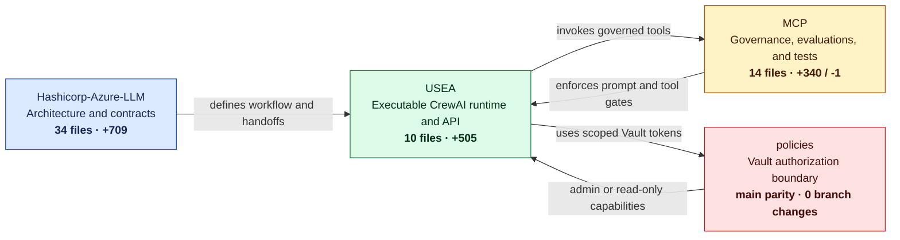
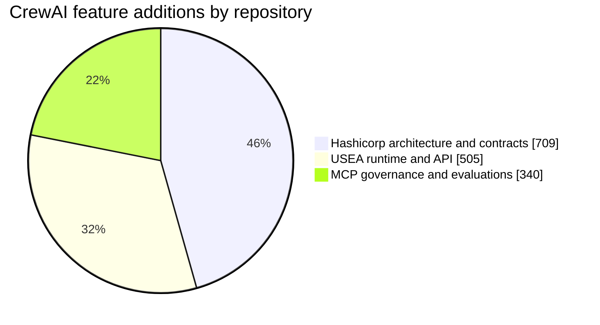
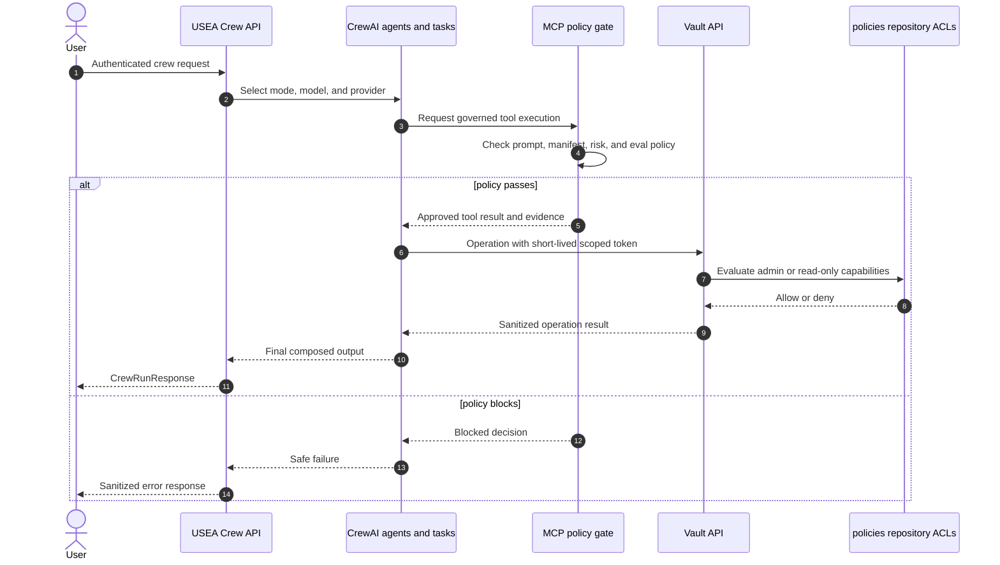

# CrewAI Multi-Repository Branch Comparison

> Visual review artifact for comparing the CrewAI feature work with the current `main` branch across every participating repository.

**Snapshot date:** 2026-08-15  
**Comparison basis:** three-dot Git comparison, `origin/main...HEAD`, which shows the changes introduced since each feature branch diverged from `main`.

## Executive View

The feature is distributed across four repositories. It should be reviewed as one vertical capability rather than as four unrelated diffs.

## Measured Delta

| Repository | Branch compared with `main` | Files changed | Additions | Deletions | Improvement represented |
|---|---|---:|---:|---:|---|
| [Hashicorp-Azure-LLM](https://github.com/iestarks/Hashicorp-Azure-LLM) | `copilot/crewai-integration-scaffolding` | 34 | 709 | 0 | Architecture, agents, task contracts, environment profiles, governance, runbooks, and metrics |
| [USEA](https://github.com/iestarks/USEA) | `copilot/resume-crewai-scaffolding` | 10 | 505 | 0 | Working multi-agent runtime, task composition, authenticated API endpoint, models, dependencies, and tests |
| [MCP](https://github.com/iestarks/MCP) | `copilot/resume-crewai-scaffolding` | 14 | 340 | 1 | Governed-agent profile, MCP configuration, prompt/tool baselines, risk policy, refusal evaluations, and tests |
| [policies](https://github.com/iestarks/policies) | `main` | 0 | 0 | 0 | Existing external Vault ACL control plane; included because CrewAI-driven Vault actions ultimately depend on these scoped capabilities |
| **Feature total** |  | **58** | **1,554** | **1** | Design → runtime → governance → authorization |

The policy repository is omitted from the additions chart because it is already on `main` and has no feature-branch delta. Its role is architectural and operational, not a claim of new lines in this branch set.

## Before and After

| Capability | Current `main` baseline | CrewAI feature outcome |
|---|---|---|
| Multi-agent design | No shared cross-repository CrewAI operating model | Named architecture, specialist agents, ordered tasks, contracts, environment controls, approval gates, runbooks, and metrics |
| Runtime execution | No CrewAI workflow exposed through USEA | Research/writing and operations crews with reusable agents and tasks, model/provider selection, and authenticated `POST /v1/crew/run` execution |
| Governance | Existing generic policy-gate framework | CrewAI-specific profile, reviewed prompt and tool baselines, MCP configuration, risk classifications, refusal fixtures, and automated gate tests |
| Vault authorization | Existing admin and read-only Vault policies | Explicit integration boundary: CrewAI/Vault workflows remain constrained by short-lived, role-scoped Vault tokens rather than root-equivalent access |
| Verification | No end-to-end CrewAI review surface | A traceable path from architecture to runtime behavior, policy evidence, tests, and final Vault enforcement |

## Repository Detail

### 1. Hashicorp-Azure-LLM: architecture and contracts

This repository defines what the CrewAI system is intended to do and how repositories exchange governed requests and evidence.

Key review surfaces:

- [`crewai/architecture/sequence-flow.md`](https://github.com/iestarks/Hashicorp-Azure-LLM/blob/copilot/crewai-integration-scaffolding/crewai/architecture/sequence-flow.md): plan-first workflow from infrastructure design through post-deploy verification.
- [`crewai/agents/infra_crew.yaml`](https://github.com/iestarks/Hashicorp-Azure-LLM/blob/copilot/crewai-integration-scaffolding/crewai/agents/infra_crew.yaml): orchestrator and specialist-agent composition.
- [`crewai/contracts/compatibility-matrix.md`](https://github.com/iestarks/Hashicorp-Azure-LLM/blob/copilot/crewai-integration-scaffolding/crewai/contracts/compatibility-matrix.md): cross-repository adoption and compatibility expectations.
- [`crewai/governance/guardrails.md`](https://github.com/iestarks/Hashicorp-Azure-LLM/blob/copilot/crewai-integration-scaffolding/crewai/governance/guardrails.md): safety boundaries and approval requirements.
- [`crewai/metrics/evaluation-framework.md`](https://github.com/iestarks/Hashicorp-Azure-LLM/blob/copilot/crewai-integration-scaffolding/crewai/metrics/evaluation-framework.md): measurable quality and reliability targets.

**Visual diff:** [compare `main...copilot/crewai-integration-scaffolding`](https://github.com/iestarks/Hashicorp-Azure-LLM/compare/main...copilot/crewai-integration-scaffolding)

### 2. USEA: executable multi-agent runtime

This repository turns the architecture into application behavior.

Key review surfaces:

- [`crew/agents.py`](https://github.com/iestarks/USEA/blob/copilot/resume-crewai-scaffolding/crew/agents.py): research, writing, and operations agent definitions.
- [`crew/tasks.py`](https://github.com/iestarks/USEA/blob/copilot/resume-crewai-scaffolding/crew/tasks.py): reusable task contracts and context chaining.
- [`crew/crew.py`](https://github.com/iestarks/USEA/blob/copilot/resume-crewai-scaffolding/crew/crew.py): sequential crew orchestration and supported execution modes.
- [`api/crew_endpoints.py`](https://github.com/iestarks/USEA/blob/copilot/resume-crewai-scaffolding/api/crew_endpoints.py): authenticated, non-blocking HTTP execution surface.
- [`tests/test_crew.py`](https://github.com/iestarks/USEA/blob/copilot/resume-crewai-scaffolding/tests/test_crew.py): runtime and endpoint behavior coverage.

**Visual diff:** [PR #25 · Files changed](https://github.com/iestarks/USEA/pull/25/files)  
**Direct comparison:** [`main...copilot/resume-crewai-scaffolding`](https://github.com/iestarks/USEA/compare/main...copilot/resume-crewai-scaffolding)

### 3. MCP: governance and evaluation

This repository makes the CrewAI runtime reviewable and enforceable as an AI-SDLC workload.

Key review surfaces:

- [`profiles/crewai.yaml`](https://github.com/iestarks/MCP/blob/copilot/resume-crewai-scaffolding/profiles/crewai.yaml): governed-agent profile joining prompt, tools, MCP servers, and evaluations.
- [`configs/crewai.mcp.json`](https://github.com/iestarks/MCP/blob/copilot/resume-crewai-scaffolding/configs/crewai.mcp.json): pinned and reviewed MCP server configuration.
- [`evals/crewai_suite.yaml`](https://github.com/iestarks/MCP/blob/copilot/resume-crewai-scaffolding/evals/crewai_suite.yaml): expected tool use and blocking refusal cases.
- [`policies/tool_manifest_policy.yaml`](https://github.com/iestarks/MCP/blob/copilot/resume-crewai-scaffolding/policies/tool_manifest_policy.yaml): risk classification for CrewAI tools.
- [`tests/test_crewai_profile.py`](https://github.com/iestarks/MCP/blob/copilot/resume-crewai-scaffolding/tests/test_crewai_profile.py): prompt, tool-manifest, and evaluation gate tests.

**Visual diff:** [PR #2 · Files changed](https://github.com/iestarks/MCP/pull/2/files)  
**Direct comparison:** [`main...copilot/resume-crewai-scaffolding`](https://github.com/iestarks/MCP/compare/main...copilot/resume-crewai-scaffolding)

### 4. policies: Vault authorization boundary

This repository has no CrewAI feature branch and is currently identical to `origin/main`. It is included because it holds the final authorization rules for Vault operations initiated through an agentic workflow.

Key review surfaces:

- [`vault/policies/vault-web-agent-admin.hcl`](https://github.com/iestarks/policies/blob/main/vault/policies/vault-web-agent-admin.hcl): scoped administrative capabilities for health, seal state, auth methods, secrets engines, ACL policies, identity, and token lifecycle. It deliberately excludes root-equivalent `path "*"` access.
- [`vault/policies/vault-web-agent-readonly.hcl`](https://github.com/iestarks/policies/blob/main/vault/policies/vault-web-agent-readonly.hcl): deny-by-default inspection capabilities with no write, delete, sudo, seal/unseal, or secret-value access.
- [`POLICY_SYNC_STEPS.md`](https://github.com/iestarks/policies/blob/main/POLICY_SYNC_STEPS.md): policy synchronization procedure for consuming repositories.

**Visual baseline:** [`main` branch](https://github.com/iestarks/policies/tree/main)  
**Branch status:** no `main...HEAD` changes at the time of this snapshot.

## End-to-End Outcome

## Recommended Visual Review

1. Open each **Visual diff** link above and select split view.
2. Hide whitespace changes and review in this order: Hashicorp → USEA → MCP → policies.
3. Render this file with **Markdown: Open Preview to the Side** in VS Code to inspect the diagrams while reading each diff.
4. Confirm the Hashicorp contracts match the USEA request/runtime behavior.
5. Confirm every USEA tool capability is represented in the MCP manifest and evaluation suite.
6. Confirm Vault-impacting behavior remains bounded by the admin/read-only HCL policies.
7. Run repository tests before merge and attach their results to the corresponding pull requests.

## Merge Readiness Checklist

- [ ] Hashicorp architecture and contracts reviewed.
- [ ] USEA CrewAI runtime and authenticated endpoint reviewed.
- [ ] USEA CrewAI tests pass.
- [ ] MCP prompt and tool baselines match the runtime surface.
- [ ] MCP CrewAI static evaluations and profile tests pass.
- [ ] Vault admin policy remains scoped and non-root-equivalent.
- [ ] Vault read-only policy cannot read secret values or mutate state.
- [ ] Cross-repository contract names and versions agree.
- [ ] Required human approval gates are preserved for production-impacting work.
- [ ] All visual diffs are reviewed before any branch is merged.

---

This file is intentionally copied into the `crewai/` directory of all four repositories so each pull request exposes the same cross-repository review context.